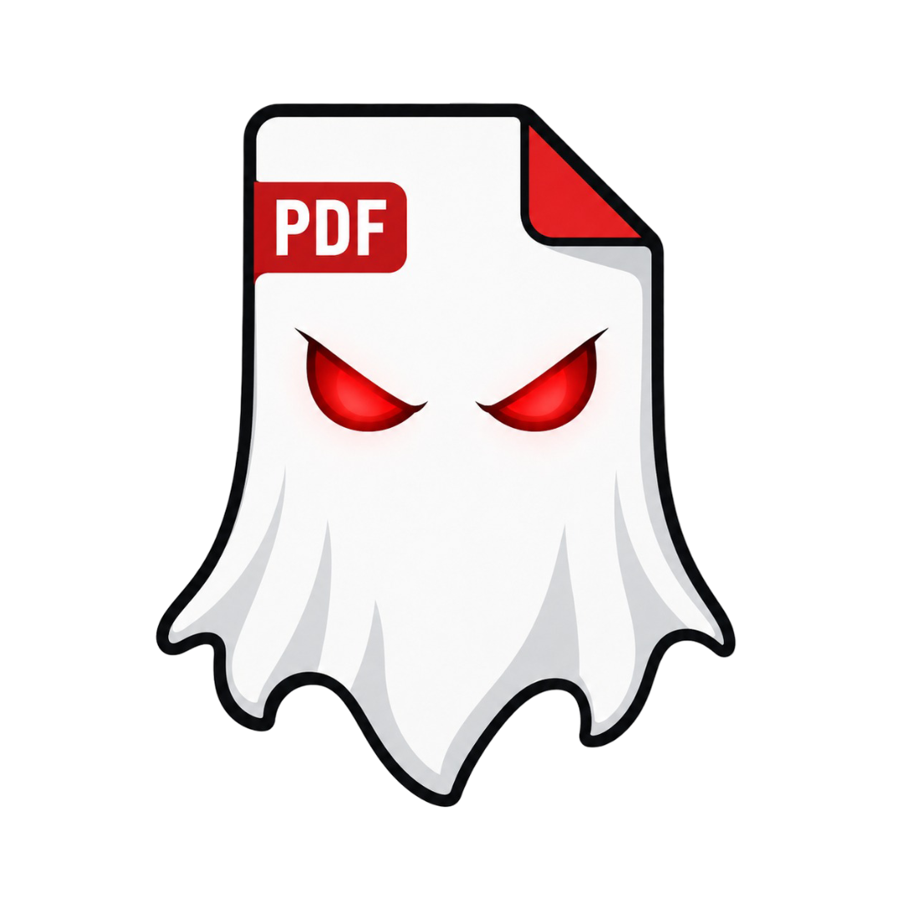

# GhostMark



Professional PDF watermarking. Private by design.

GhostMark is a free, open-source, browser-based tool for applying serious document watermarks to PDF files. It is built for local processing, clear controls, and honest privacy expectations.

## Overview

GhostMark adds text, repeated pattern, classification banner, seal, and image watermarks to PDF documents directly in the browser. The app has no backend, database, analytics, cookies, telemetry, or account system.

Your document never leaves your device through GhostMark.

## Brand

GhostMark uses a document ghost mark as its local brand asset. The image is stored in `public/brand/ghostmark-logo.png` and is used only as a local static asset.

GhostMark is a privacy-first PDF watermarking tool designed for local document workflows. It does not upload documents, use accounts, or include built-in tracking.

GhostMark is not a certified classified-document handling system. For sensitive workflows, use the offline build in an isolated environment.

## Features

- Local PDF import with file validation, page count, and file details.
- PDF preview rendered in the browser with PDF.js.
- Text watermark configuration with size, color, opacity, rotation, and positioning.
- Repeated pattern watermark export.
- Top and bottom classification banner export.
- Simple document-control seal export.
- Image watermark export for PNG and JPG assets.
- Page rules for all, first, last, odd, even, range, specific, and excluded pages.
- Local Blob download using `pdf-lib`.
- Security Center with honest privacy checks.
- Classified Mode for stricter local handling.
- Internationalization architecture with 10 language options and RTL support for Arabic and Urdu.
- Static GitHub Pages deployment.

## Privacy Model

GhostMark processes PDFs locally in the browser. The selected PDF is held in browser memory for the active session and is not uploaded by the application.

GhostMark has:

- No backend.
- No database.
- No analytics.
- No cookies.
- No tracking.
- No telemetry.
- No remote API calls.
- No CDN-hosted scripts or fonts.
- No automatic document persistence.

Hosted static pages may still generate technical access logs at the hosting provider level, such as IP address, request time, and browser metadata.

## What GhostMark Does Not Do

GhostMark does not provide:

- User accounts.
- Cloud sync.
- Recent documents.
- Document history.
- File upload endpoints.
- Analytics or error telemetry.
- A certified classified-document handling environment.
- Guaranteed anonymity.
- Compliance guarantees.

## Security Limitations

GhostMark can verify its own application configuration, but it cannot audit or control the surrounding environment.

Browser extensions, compromised devices, screen recording tools, operating-system telemetry, network monitoring, and hosting-provider logs are outside GhostMark's control.

For sensitive documents, use the offline build in an isolated environment with network access disabled.

## Classified Mode

Classified Mode is designed for stricter local handling:

- Language selection stays in memory only.
- Persistent storage is avoided.
- Document history and autosave features are not present.
- A warning is shown before leaving with a loaded document.
- Export cleanup is stricter.

GhostMark is not certified for classified information. For truly sensitive environments, use an offline build with network access disabled.

## Offline Usage

Recommended sensitive workflow:

1. Clone this repository or download a release archive.
2. Run `npm install`.
3. Run `npm run build`.
4. Serve `dist` locally with a static server.
5. Disconnect network access if required by your environment.
6. Process documents locally.

Avoid relying on `file://` for production use. Some browsers restrict module workers, PDF.js worker loading, or generated Blob behavior when opening the app directly from the filesystem.

## Tech Stack

- TypeScript
- React
- Vite
- Tailwind CSS
- PDF.js through `pdfjs-dist`
- `pdf-lib`
- Vitest

## Development

Install dependencies:

```bash
npm install
```

Run the development server:

```bash
npm run dev
```

Build the static app:

```bash
npm run build
```

Preview the production build:

```bash
npm run preview
```

Typecheck:

```bash
npm run typecheck
```

## Testing

Run deterministic utility tests:

```bash
npm run test
```

The current test suite covers page selection parsing and rule resolution.

## GitHub Pages Deployment

Vite is configured with:

```ts
base: "/GhostMark/"
```

The GitHub Actions workflow in `.github/workflows/deploy.yml` installs dependencies, builds the app, uploads the `dist` artifact, and deploys it using official GitHub Pages actions.

## Project Structure

```text
src/
  app/                 Application state and providers
  components/          Layout, UI, PDF, watermark, security, and export components
  features/            PDF, watermark, security, and i18n utilities
  types/               Shared TypeScript types
  styles/              Tailwind global styles
public/
  brand/               Local GhostMark brand assets
  icons/               Reserved for local app icons
  fonts/               Reserved for local font files only
```

## Roadmap

v1.0:

- PDF import
- Preview
- Text watermark
- Pattern watermark
- Classification banner
- Seal
- Page rules
- Local export
- Security center
- Classified mode
- i18n architecture

v1.1:

- Image watermark export refinements
- Thumbnail rail
- Drag-and-drop positioning
- Metadata tools
- Stronger offline packaging

v1.2:

- Encrypted export package
- Custom fonts
- Advanced templates
- Keyboard shortcuts
- Accessibility audit

## License

GhostMark is released under the MIT License. See [LICENSE](LICENSE).
