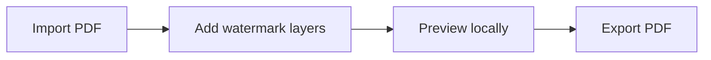

# GhostMark

<p align="center">
  
</p>

<p align="center">
  <strong>Private PDF watermark editor in your browser.</strong>
</p>

<p align="center">
  <a href="https://marichu-kt.github.io/GhostMark/">Open GhostMark</a>
  |
  <a href="https://marichu-kt.github.io/GhostMark/pdf-watermark-editor/">PDF watermark editor</a>
</p>

GhostMark is a free, privacy-first PDF watermark editor. Add text, image, pattern, and professional seal watermarks locally in your browser. Your PDF is not uploaded.



## Features

| Feature | Status |
| --- | --- |
| Text watermark | Ready |
| Image watermark | Ready |
| Pattern watermark | Ready |
| Professional seal | Ready |
| Multi-layer editing | Ready |
| Local processing | Ready |
| No upload | Ready |

## Privacy

No backend, database, analytics, cookies, telemetry, accounts, upload endpoint, or cloud sync. Files stay in browser memory while you work.

## Run Locally

```bash
npm install
npm run dev
npm run build
```

## Limitations

- Preview is visual; export is authoritative.
- Very large PDFs can be slower.
- Hosted GitHub Pages may create provider-level access logs.
- GhostMark is not a certified classified-document handling system.

## Languages

| Language | Summary |
| --- | --- |
| English | Private PDF watermark editor in your browser. |
| Español | Editor privado para poner marcas de agua en PDF desde el navegador. |
| Français | Éditeur privé de filigranes PDF dans le navigateur. |
| Português | Editor privado de marcas d'água em PDF no navegador. |
| 中文 | 在浏览器中本地为 PDF 添加水印。 |
| हिन्दी | ब्राउज़र में स्थानीय रूप से PDF वॉटरमार्क जोड़ें। |
| العربية | أضف علامات مائية إلى ملفات PDF محليًا من المتصفح. |
| বাংলা | ব্রাউজারে স্থানীয়ভাবে PDF-এ ওয়াটারমার্ক যোগ করুন। |
| Русский | Добавляйте водяные знаки в PDF локально в браузере. |
| اردو | براؤزر میں مقامی طور پر PDF واٹرمارک شامل کریں۔ |
| עברית | הוספת סימני מים ל-PDF באופן מקומי בדפדפן. |

## License

GhostMark is released under the MIT License. See [LICENSE](LICENSE).

Additional usage and liability notes are available in [DISCLAIMER.md](DISCLAIMER.md).
