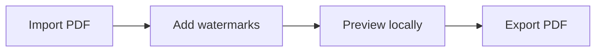

# GhostMark

<p align="center">
  
</p>

<p align="center">
  <strong>Private PDF watermarking in your browser.</strong>
</p>

GhostMark is a free, open-source PDF watermarking app built for local document workflows. Import a PDF, add one or more watermark layers, preview the result, and export a new PDF without uploading your document.



## Features

- Text, image, pattern, banner, and seal watermark layers.
- Multiple enabled layers with ordering, duplication, and per-layer page rules.
- Live visual preview powered by PDF.js.
- Local PDF export powered by pdf-lib.
- Drag-and-drop PDF import.
- 11 interface languages, including Hebrew, Arabic, and Urdu with RTL support.
- Static GitHub Pages deployment.

## Privacy

GhostMark has no backend, database, analytics, cookies, telemetry, accounts, upload endpoint, or cloud sync.

Your PDF is processed in browser memory. Hosted static pages may still create provider-level access logs, so sensitive workflows should use an offline build in an isolated environment.

GhostMark is not a certified classified-document handling system.

## Use Locally

```bash
npm install
npm run dev
```

Build the static app:

```bash
npm run build
npm run preview
```

For sensitive documents:

1. Clone or download GhostMark.
2. Run `npm install`.
3. Run `npm run build`.
4. Serve `dist` locally.
5. Disconnect the network if required.
6. Process documents locally.

## Tech Stack

- React + TypeScript + Vite
- Tailwind CSS
- PDF.js / `pdfjs-dist`
- `pdf-lib`
- Vitest

## Development

```bash
npm run typecheck
npm run test
npm run build
```

Vite is configured for GitHub Pages with:

```ts
base: "/GhostMark/"
```

## License

MIT. See [LICENSE](LICENSE).
