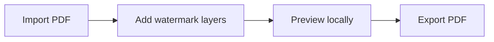

# GhostMark

<p align="center">
  
</p>

<p align="center">
  <strong>Private PDF watermark editor in your browser.</strong>
</p>

<p align="center">
  <a href="https://marichu-kt.github.io/GhostMark/">Open GhostMark</a>
  |
  <a href="https://marichu-kt.github.io/GhostMark/pdf-watermark-editor/">PDF Watermark Editor</a>
</p>

## English

GhostMark is a free, privacy-first PDF watermark editor. Add text, image, pattern, and professional seal watermarks locally in your browser. Your PDF is not uploaded.



**Features:** text watermark, image watermark, repeated pattern, professional seal, multi-layer editing, live preview, local export.

**Use:** import a PDF, add one or more watermark layers, preview the document, and export a new PDF.

**Privacy:** no backend, database, analytics, cookies, telemetry, accounts, upload endpoint, or cloud sync. Files stay in browser memory while you work.

**Run locally:**

```bash
npm install
npm run dev
npm run build
```

**Limitations:** preview is visual; export is authoritative. Very large PDFs can be slower. Hosted GitHub Pages may create provider-level access logs. GhostMark is not a certified classified-document handling system.

## Languages

- [English](#english)
- [Español](#español)
- [Français](#français)
- [Português](#português)
- [中文](#中文)
- [हिन्दी](#हिन्दी)
- [العربية](#العربية)
- [বাংলা](#বাংলা)
- [Русский](#русский)
- [اردو](#اردو)
- [עברית](#עברית)

## Español

GhostMark es un editor privado y gratuito para poner marcas de agua en PDF desde el navegador. Puedes añadir texto, imagen, patrón y sellos profesionales sin subir el archivo.

- Funciones: marca de texto, imagen, patrón repetido, sello profesional, varias capas y vista previa.
- Privacidad: sin backend, sin cuentas, sin analítica, sin cookies y sin endpoint de subida.
- Uso: importa un PDF, añade capas de marca de agua, revisa la vista previa y exporta un PDF nuevo.

## Français

GhostMark est un éditeur gratuit et privé de filigranes PDF dans le navigateur. Ajoutez du texte, une image, un motif ou un sceau professionnel sans téléverser le fichier.

- Fonctions : filigrane texte, image, motif répété, sceau professionnel, couches multiples et aperçu.
- Confidentialité : pas de backend, pas de comptes, pas d'analytics, pas de cookies et pas d'endpoint d'envoi.
- Utilisation : importez un PDF, ajoutez des couches de filigrane, vérifiez l'aperçu et exportez un nouveau PDF.

## Português

GhostMark é um editor gratuito e privado de marcas d'água em PDF no navegador. Adicione texto, imagem, padrão e selo profissional sem enviar o arquivo.

- Recursos: marca de texto, imagem, padrão repetido, selo profissional, múltiplas camadas e pré-visualização.
- Privacidade: sem backend, contas, analytics, cookies ou endpoint de upload.
- Uso: importe um PDF, adicione camadas de marca d'água, revise a prévia e exporte um novo PDF.

## 中文

GhostMark 是一款免费的隐私优先 PDF 水印编辑器，可直接在浏览器中使用。你可以在本地添加文字、图片、重复图案和专业印章水印，PDF 不会上传。

- 功能：文字水印、图片水印、重复图案、专业印章、多图层编辑和实时预览。
- 隐私：无后端、无账户、无分析、无 Cookie、无上传接口。
- 使用：导入 PDF，添加水印图层，预览效果，然后导出新的 PDF。

## हिन्दी

GhostMark ब्राउज़र में चलने वाला मुफ़्त, privacy-first PDF watermark editor है। आप text, image, pattern और professional seal watermark स्थानीय रूप से जोड़ सकते हैं; PDF upload नहीं होता।

- सुविधाएँ: text watermark, image watermark, repeated pattern, professional seal, multi-layer editing और live preview।
- गोपनीयता: कोई backend, account, analytics, cookies या upload endpoint नहीं।
- उपयोग: PDF import करें, watermark layers जोड़ें, preview देखें और नया PDF export करें।

## العربية

GhostMark محرر مجاني وخاص لإضافة علامات مائية إلى ملفات PDF داخل المتصفح. يمكنك إضافة نص أو صورة أو نمط متكرر أو ختم مهني دون رفع الملف.

- الميزات: علامة نصية، علامة صورة، نمط متكرر، ختم مهني، طبقات متعددة ومعاينة مباشرة.
- الخصوصية: لا يوجد خادم خلفي، ولا حسابات، ولا تحليلات، ولا ملفات تعريف ارتباط، ولا نقطة رفع.
- الاستخدام: استورد ملف PDF، أضف طبقات العلامة المائية، راجع المعاينة، ثم صدّر ملف PDF جديدًا.

## বাংলা

GhostMark হলো ব্রাউজারে চলা একটি বিনামূল্যের privacy-first PDF watermark editor। আপনি টেক্সট, ছবি, প্যাটার্ন এবং পেশাদার সিল ওয়াটারমার্ক স্থানীয়ভাবে যোগ করতে পারেন; PDF আপলোড হয় না।

- সুবিধা: টেক্সট ওয়াটারমার্ক, ছবি ওয়াটারমার্ক, পুনরাবৃত্ত প্যাটার্ন, পেশাদার সিল, বহু-স্তর সম্পাদনা এবং লাইভ প্রিভিউ।
- গোপনীয়তা: কোনো backend, account, analytics, cookies বা upload endpoint নেই।
- ব্যবহার: PDF import করুন, watermark layer যোগ করুন, preview দেখুন এবং নতুন PDF export করুন।

## Русский

GhostMark — бесплатный приватный редактор водяных знаков PDF в браузере. Добавляйте текст, изображение, повторяющийся шаблон и профессиональную печать без загрузки файла на сервер.

- Возможности: текстовый знак, изображение, повторяющийся шаблон, профессиональная печать, несколько слоев и предпросмотр.
- Конфиденциальность: нет backend, аккаунтов, analytics, cookies и endpoint для загрузки.
- Использование: импортируйте PDF, добавьте слои водяных знаков, проверьте предпросмотр и экспортируйте новый PDF.

## اردو

GhostMark براؤزر میں چلنے والا مفت، privacy-first PDF watermark editor ہے۔ آپ text، image، pattern اور professional seal watermark مقامی طور پر شامل کر سکتے ہیں؛ PDF upload نہیں ہوتا۔

- خصوصیات: text watermark، image watermark، repeated pattern، professional seal، multi-layer editing اور live preview۔
- رازداری: کوئی backend، account، analytics، cookies یا upload endpoint نہیں۔
- استعمال: PDF import کریں، watermark layers شامل کریں، preview دیکھیں اور نیا PDF export کریں۔

## עברית

GhostMark הוא עורך סימני מים חינמי ופרטי ל-PDF שפועל בדפדפן. ניתן להוסיף טקסט, תמונה, תבנית חוזרת וחותמת מקצועית באופן מקומי, בלי להעלות את הקובץ.

- יכולות: סימן מים טקסטואלי, תמונה, תבנית חוזרת, חותמת מקצועית, עריכת שכבות ותצוגה מקדימה.
- פרטיות: ללא backend, חשבונות, analytics, cookies או נקודת העלאה.
- שימוש: ייבאו PDF, הוסיפו שכבות סימן מים, בדקו תצוגה מקדימה וייצאו PDF חדש.

## License

GhostMark is released under the MIT License. See [LICENSE](LICENSE).

Additional usage and liability notes are available in [DISCLAIMER.md](DISCLAIMER.md).
