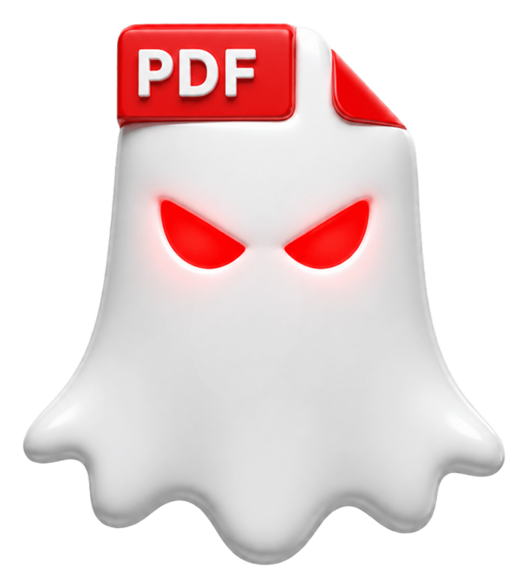
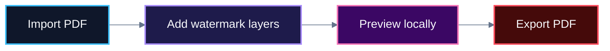

# GhostMark

<p align="center">
  
</p>

<p align="center">
  
</p>

<p align="center">
  <strong>Private PDF watermark editor in your browser.</strong>
</p>

<p align="center">
  <a href="https://marichu-kt.github.io/GhostMark/">Open GhostMark</a>
  ·
  <a href="https://marichu-kt.github.io/GhostMark/pdf-watermark-editor/">PDF Watermark Editor</a>
  ·
  <a href="./DISCLAIMER.md">Disclaimer</a>
</p>

---

## Overview

GhostMark is a free, privacy-first PDF watermark editor.

It lets you add **text**, **image**, **pattern**, and **professional seal** watermarks to PDF files directly in your browser.

Your PDF is processed locally. It is not uploaded to a server.



> [!NOTE]
> GhostMark is a static browser app. It has no backend, no upload endpoint, and no account system.

---

## Features

* **Text watermark** — add custom text with size, opacity, color, rotation, and position controls.
* **Image watermark** — place a logo or image over your PDF.
* **Pattern watermark** — repeat text across pages as a subtle document mark.
* **Professional seal** — add document-control style stamps.
* **Multi-layer editing** — combine several watermark layers in one PDF.
* **Live preview** — review changes before exporting.
* **Local PDF export** — generate the final PDF in your browser.
* **No upload** — files stay on your device while you work.

> [!TIP]
> Combine a subtle repeated pattern with a professional seal for documents that need both visibility and document-control style marking.

---

## How to use

1. Open GhostMark.
2. Import a PDF.
3. Add one or more watermark layers.
4. Preview the result locally.
5. Export a new PDF.

> [!IMPORTANT]
> The preview is visual. The exported PDF is the authoritative final output.

---

## Privacy model

GhostMark is designed to run without a backend.

It does **not** include:

* upload endpoints
* user accounts
* analytics
* cookies
* telemetry
* tracking
* cloud sync
* databases

Files stay in browser memory while you work.

> [!WARNING]
> Hosted GitHub Pages may still generate provider-level technical access logs, such as request time, IP address, browser metadata, or requested paths. This is outside GhostMark’s application code.

> [!CAUTION]
> For sensitive, regulated, confidential, or classified documents, use a local/offline build in a controlled environment. GhostMark is not a certified legal, compliance, forensic, records-management, or classified-document handling system.

---

## Run locally

```bash
npm install
npm run dev
npm run build
```

Preview the production build:

```bash
npm run preview
```

> [!TIP]
> For more private workflows, build the app locally and run it in an isolated environment with network access disabled.

---

## Supported languages

<details>
<summary><strong>English</strong></summary>

GhostMark is a private PDF watermark editor that runs in your browser.

* Add text, image, pattern, and professional seal watermarks.
* Preview the PDF locally before exporting.
* Export a new watermarked PDF.
* Files are not uploaded to a server.

</details>

<details>
<summary><strong>Español</strong></summary>

GhostMark es un editor privado para poner marcas de agua en PDF desde el navegador.

* Añade marcas de texto, imagen, patrón y sello profesional.
* Revisa el PDF con vista previa local.
* Exporta un nuevo PDF con marca de agua.
* Los archivos no se suben a ningún servidor.

</details>

<details>
<summary><strong>Français</strong></summary>

GhostMark est un éditeur privé de filigranes PDF dans le navigateur.

* Ajoutez du texte, des images, des motifs et des sceaux professionnels.
* Prévisualisez le PDF localement avant l’export.
* Exportez un nouveau PDF filigrané.
* Les fichiers ne sont pas téléversés vers un serveur.

</details>

<details>
<summary><strong>Português</strong></summary>

GhostMark é um editor privado de marcas d’água em PDF no navegador.

* Adicione marcas de texto, imagem, padrão e selo profissional.
* Visualize o PDF localmente antes de exportar.
* Exporte um novo PDF com marca d’água.
* Os arquivos não são enviados para um servidor.

</details>

<details>
<summary><strong>中文</strong></summary>

GhostMark 是一个在浏览器中运行的私密 PDF 水印编辑器。

* 添加文字、图片、图案和专业印章水印。
* 在本地预览 PDF。
* 导出新的带水印 PDF。
* 文件不会上传到服务器。

</details>

<details>
<summary><strong>हिन्दी</strong></summary>

GhostMark ब्राउज़र में चलने वाला निजी PDF वॉटरमार्क एडिटर है।

* टेक्स्ट, इमेज, पैटर्न और प्रोफेशनल सील वॉटरमार्क जोड़ें।
* एक्सपोर्ट से पहले PDF को स्थानीय रूप से प्रीव्यू करें।
* नया वॉटरमार्क वाला PDF एक्सपोर्ट करें।
* फ़ाइलें किसी सर्वर पर अपलोड नहीं होतीं।

</details>

<details>
<summary><strong>العربية</strong></summary>

GhostMark محرر خاص لإضافة العلامات المائية إلى ملفات PDF داخل المتصفح.

* أضف علامات مائية نصية أو صورية أو نمطية أو أختامًا احترافية.
* عاين ملف PDF محليًا قبل التصدير.
* صدّر ملف PDF جديدًا بعلامة مائية.
* لا يتم رفع الملفات إلى أي خادم.

</details>

<details>
<summary><strong>বাংলা</strong></summary>

GhostMark হলো ব্রাউজারে চলা একটি ব্যক্তিগত PDF ওয়াটারমার্ক সম্পাদক।

* টেক্সট, ছবি, প্যাটার্ন এবং পেশাদার সিল ওয়াটারমার্ক যোগ করুন।
* এক্সপোর্টের আগে PDF স্থানীয়ভাবে প্রিভিউ করুন।
* নতুন ওয়াটারমার্কযুক্ত PDF এক্সপোর্ট করুন।
* ফাইল কোনো সার্ভারে আপলোড হয় না।

</details>

<details>
<summary><strong>Русский</strong></summary>

GhostMark — приватный редактор водяных знаков PDF в браузере.

* Добавляйте текстовые, графические, шаблонные и профессиональные водяные знаки.
* Просматривайте PDF локально перед экспортом.
* Экспортируйте новый PDF с водяным знаком.
* Файлы не загружаются на сервер.

</details>

<details>
<summary><strong>اردو</strong></summary>

GhostMark براؤزر میں چلنے والا نجی PDF واٹرمارک ایڈیٹر ہے۔

* متن، تصویر، پیٹرن اور پروفیشنل سیل واٹرمارک شامل کریں۔
* ایکسپورٹ سے پہلے PDF کا مقامی پریویو دیکھیں۔
* نیا واٹرمارک شدہ PDF ایکسپورٹ کریں۔
* فائلیں کسی سرور پر اپلوڈ نہیں ہوتیں۔

</details>

<details>
<summary><strong>עברית</strong></summary>

GhostMark הוא עורך פרטי להוספת סימני מים לקובצי PDF בדפדפן.

* הוספת סימני מים מסוג טקסט, תמונה, תבנית וחותמת מקצועית.
* תצוגה מקדימה מקומית לפני ייצוא.
* ייצוא קובץ PDF חדש עם סימן מים.
* הקבצים אינם מועלים לשרת.

</details>

---

## Notes

* Preview is visual; export is authoritative.
* Very large PDFs may be slower to preview or export.
* The hosted GitHub Pages version is public static hosting.
* For sensitive files, prefer a local/offline build.
* Vite is configured for GitHub Pages with `base: "/GhostMark/"`.

---

## License

GhostMark is released under the MIT License. See [LICENSE](LICENSE).

Responsible use, liability, and legal notes are available in [DISCLAIMER.md](DISCLAIMER.md).
