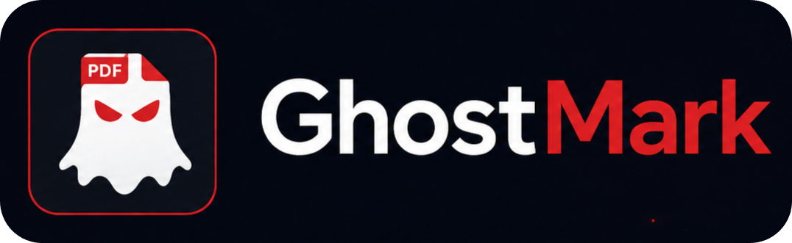
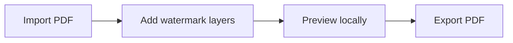

# GhostMark

<p align="center">
  
</p>

<p align="center">
  <strong>Private PDF watermark editor in your browser.</strong>
</p>

<p align="center">
  <a href="https://marichu-kt.github.io/GhostMark/">Open GhostMark</a>
  ·
  <a href="https://marichu-kt.github.io/GhostMark/editor-pdf-marca-agua">Editor de PDFs para poner marcas de agua</a>
</p>

GhostMark is a free, privacy-first PDF watermark editor. Add text, image, pattern, and professional seal watermarks locally in your browser. Your PDF is not uploaded.



## Features

| Feature | Status |
| --- | --- |
| Text watermark | Ready |
| Image watermark | Ready |
| Pattern watermark | Ready |
| Professional seal | Ready |
| Multi-layer editing | Ready |
| Local processing | Ready |
| No upload | Ready |

## Use

1. Import a PDF.
2. Add one or more watermark layers.
3. Preview locally.
4. Export a new PDF.

## Privacy

GhostMark has no backend, database, analytics, cookies, telemetry, accounts, upload endpoint, or cloud sync. Files stay in browser memory while you work.

Hosted GitHub Pages may still create provider-level access logs. For sensitive documents, use the offline build in an isolated environment. GhostMark is not a certified classified-document handling system.

## Run Locally

```bash
npm install
npm run dev
npm run build
```

## Notes

- Preview is visual; export is authoritative.
- Very large PDFs can be slower.
- Vite is configured for GitHub Pages with `base: "/GhostMark/"`.

## License

MIT. See [LICENSE](LICENSE).
